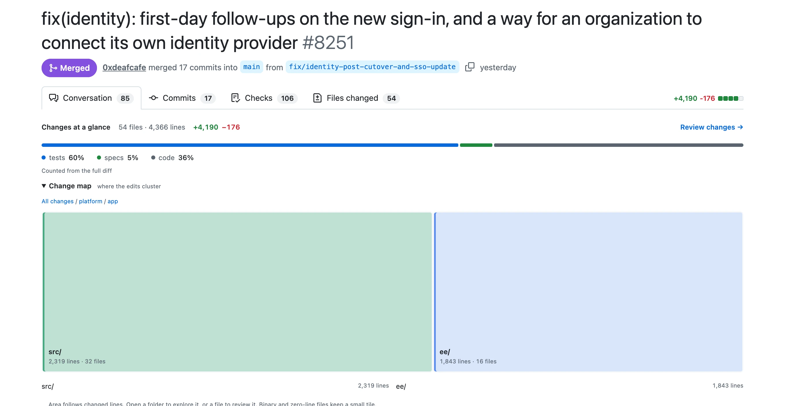
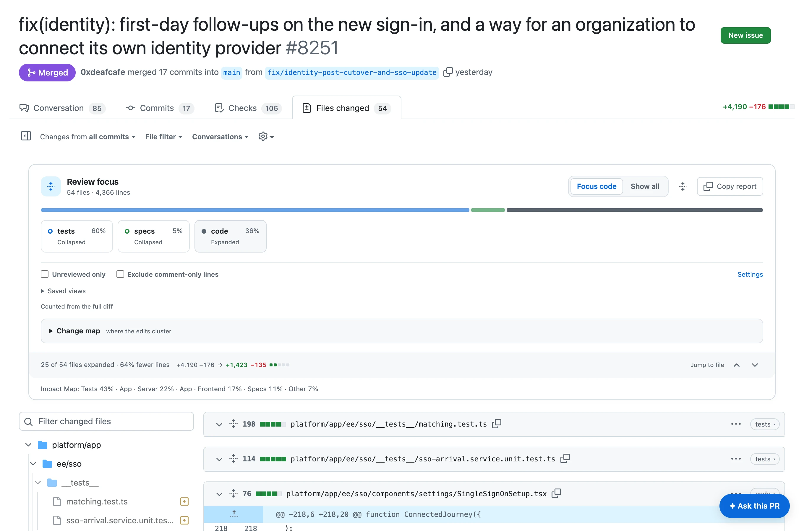
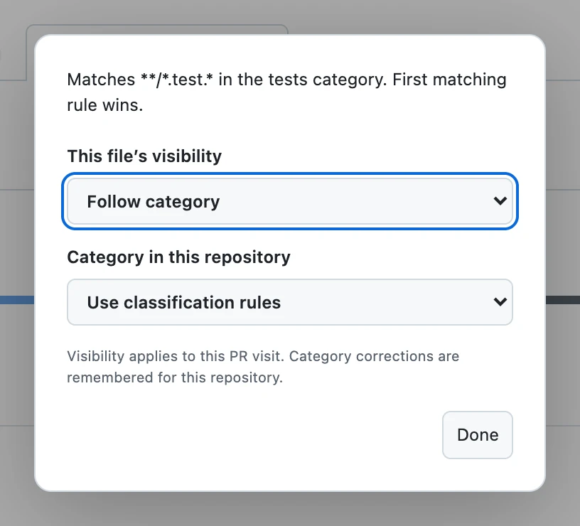
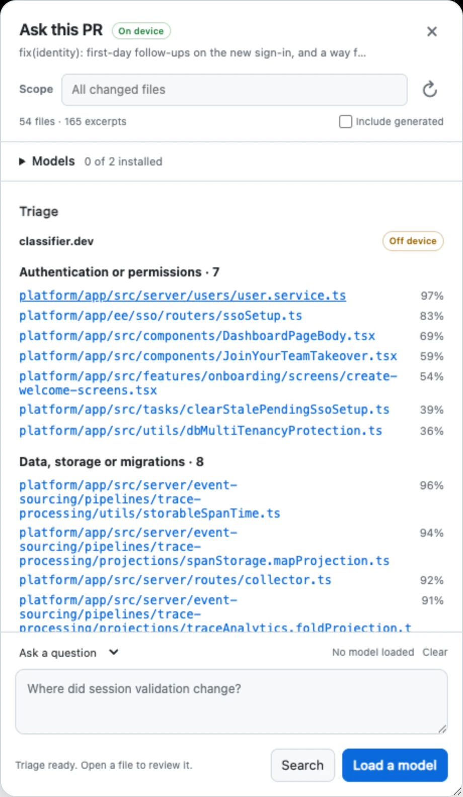

# PR Impact

[](https://github.com/0xdeafcafe/agenthub-ext/actions/workflows/build.yml)

Big PRs are a pain to review. Half the diff is tests, docs, generated code and one enormous lockfile, and GitHub gives all of it the same weight. PR Impact puts a few controls on the PR page so you can get to the bit you actually need to read.

Collapse the noise, see where the edits cluster, stop counting comments as code, and find out which files change behaviour somewhere that matters. Your filters stick per repo.

<p align="center">
  <picture>
    <source media="(prefers-color-scheme: dark)" srcset="docs/images/overview-dark.webp">
    <source media="(prefers-color-scheme: light)" srcset="docs/images/overview-light.webp">
    
  </picture>
</p>

Every screenshot here is the extension running on [langwatch/langwatch#8251](https://github.com/langwatch/langwatch/pull/8251), a real PR of mine: 54 files, 60% of it tests.

## Install it

**Arc / Chrome / Edge / Brave:** [download the ZIP](https://github.com/0xdeafcafe/agenthub-ext/releases/download/rolling/pr-impact-chrome-mv3.zip).

1. Unzip it somewhere you’ll keep it.
2. Open `arc://extensions` or `chrome://extensions`.
3. Turn on **Developer mode**.
4. Click **Load unpacked** and pick the folder with `manifest.json` in it.
5. Refresh your GitHub tabs.

That’s it. To update, replace the files in that folder, hit **Reload** on the extension and refresh GitHub again.

The download tracks the last `main` commit that passed the checks, and every merge builds fresh ZIPs. Named versions live on the [releases page](https://github.com/0xdeafcafe/agenthub-ext/releases); main builds never take over the latest stable version.

**For the AI features on this branch:** run `npm ci`, then `npm run unpacked`, and choose `dist/pr-impact-unpacked` in **Load unpacked**. Keep that folder where it is; rebuilding and clicking **Reload** updates the extension. Disable any copy loaded from another folder so only one PR Impact runs on GitHub.

Other browsers:

- **Firefox:** [download](https://github.com/0xdeafcafe/agenthub-ext/releases/download/rolling/pr-impact-firefox-mv2.zip), unzip, open `about:debugging` → **This Firefox** → **Load Temporary Add-on**, and select `manifest.json`. It’s unsigned, so Firefox forgets it on restart.
- **Safari:** [download the Xcode project](https://github.com/0xdeafcafe/agenthub-ext/releases/download/rolling/pr-impact-safari-xcode.zip), open it in Xcode, pick your signing team, then build and enable it in Safari. It’s source for an unsigned app, not an installer.

[Actions](https://github.com/0xdeafcafe/agenthub-ext/actions/workflows/build.yml) also keeps ZIPs for every PR and merge build. GitHub wraps artifact downloads in another ZIP, so unpack that first; the release links above skip the extra layer. Releases include `SHA256SUMS` if you want to check a download.

## What you get

- **Changes at a glance** sits under the PR tabs: totals, category percentages and a change map, on the first visit, before you’ve opened a single file.
- **Review focus** on Files changed. Code, tests, specs, docs and generated files each get a control; click one to expand, collapse or hide it. **Focus code** and **Show all** do what they say.
- **Change map** shows where the edits are. Bigger tile, more changed lines. Open folders, focus on one part of the repo, or jump straight to a file. Large PRs open with smart clusters that skip huge wrapper folders. It groups by path; it isn’t a dependency graph.
- **Triage** asks [classifier.dev](https://classifier.dev) which code files change behaviour, and where a mistake would hurt. Opt-in, and it asks before anything leaves the browser.
- **Ask this PR** searches the diff instantly and, if you download a model, answers questions about it on your machine.
- **Exclude comment-only lines** adjusts the counts, percentages, map and copied report. Inline code still counts.
- **Unreviewed only** skips files you’ve marked as viewed.
- **Per-file controls** live in the category pill on each file header. Override a filter, see why a file got its category, or correct that category for the whole repo.
- **Saved views** keep your categories, folder, comment counting and review filter together. Up to 20 per repo.
- **Shift+J / Shift+K** jump between files. **Copy report** copies a Markdown breakdown. Settings has defaults, repo resets and an off switch.
- **Hover Pull requests** to jump straight to GitHub’s own views: authored by you, assigned to you, involving you, waiting on your review, plus milestones and labels.

If the PR has a **PR Impact Map** comment, its summary shows up too.

## In a real PR

**Focus code** expands the code and folds tests and specs down to their headers. The footer keeps score: here, 25 of 54 files and 64% fewer lines to read.

<p align="center">
  <picture>
    <source media="(prefers-color-scheme: dark)" srcset="docs/images/focus-dark.webp">
    <source media="(prefers-color-scheme: light)" srcset="docs/images/focus-light.webp">
    
  </picture>
</p>

Every file header gets a category pill. Click it to override that one file, or to tell PR Impact it got the category wrong. Corrections are remembered for the repo, and it shows you which rule matched, so you’re not left guessing why.

<p align="center">
  <picture>
    <source media="(prefers-color-scheme: dark)" srcset="docs/images/file-menu-dark.webp">
    <source media="(prefers-color-scheme: light)" srcset="docs/images/file-menu-light.webp">
    
  </picture>
</p>

## Triage the code

Path rules can tell you a file is code. They can’t tell you whether it changes behaviour or just renames a variable. Triage sends each code file’s diff to [classifier.dev](https://classifier.dev), a zero-shot classifier, and asks it two things: what kind of change is this, and where would a mistake do the most damage?

On #8251 it sorted 25 code files in under three seconds. `user.service.ts` came back as a behaviour change in authentication at 97%, `collector.ts` as data and storage at 92%, and the refactors dropped into a folded **Looks mechanical** list at the bottom. Click a path to jump to it; **Copy triage** gives you the lot as Markdown.

<p align="center">
  <picture>
    <source media="(prefers-color-scheme: dark)" srcset="docs/images/triage-dark.webp">
    <source media="(prefers-color-scheme: light)" srcset="docs/images/triage-light.webp">
    
  </picture>
</p>

It lives in **Ask this PR**, on the welcome screen. A few things worth knowing:

- **Your diff leaves the browser.** This is the one feature that sends it anywhere, which is why it’s marked **Off device** and asks before the first send in each panel. **Cancel** sends nothing.
- **Only code goes.** Tests, specs, docs and generated files are already sorted by path, so they stay put. Scope it to a folder to send less.
- **It’s free, within limits.** classifier.dev’s free tier needs no key or account and is rate-limited per IP address. If you hit the limit, it tells you how long to wait.
- **Scores are leads, not proof.** A confidence is the model’s preference between the labels it was given, and it can call a risky change mechanical or the other way round. Use it to decide what to read first, not what to skip.

Don’t point it at code you aren’t allowed to send to a third party. For a private repo, that’s a conversation with whoever owns it.

## Ask this PR (experimental)

Open **Ask this PR** on Changes. Search works straight away, with file and line links. Pick a file or folder to keep a question focused.

For answers, expand **Models** and install **Qwen3.5 2B** (~1.1 GB), **Gemma 4 E2B** (~2.0 GB) or both. Downloads start when you click Install and stay cached for offline use. If you typed a question first, it runs when the model is ready.

- **Stop** keeps the model ready for the next question. **Unload from memory** frees it and keeps the download.
- **Copy answer** includes source references. **Retry** and **Compare** reuse the original question and excerpts. Click a citation to jump to its file.
- Closing and reopening the panel keeps the conversation for that PR and frees model memory. Reloading or navigating away clears it; nothing is saved to disk.
- Incomplete downloads get **Retry** and **Remove**. Only one PR tab can load a model at a time.

Try “What behavior changed?”, “Find edge cases” or “Check test gaps”. On a huge PR, start with one folder: a small model sees selected excerpts, not the whole repo.

Treat answers as leads and check their sources. The seeded review checks caught both models drawing wrong conclusions and suggesting weak tests; the [investigation](docs/browser-ai.md) has the details. Search works without WebGPU; answers need a compatible GPU and browser.

## Where your code goes

- **Counts, categories, the map and search** run in the page. The extension downloads the PR diff using your GitHub session, and the background worker follows public diffs to GitHub’s patch host. Diff contents aren’t saved to storage.
- **Ask this PR models** download from Hugging Face when you click Install, then run locally. Your code stays in the browser.
- **Triage** sends the code diff in scope to classifier.dev, after you say yes. Nothing else does.

## The annoying GitHub bits

The extension downloads the PR diff so counts don’t grow every time you scroll. Commit ranges work too. If the diff is unavailable, incomplete, bigger than 20 MB, or uses a comparison it can’t follow (like **Hide whitespace**), the panel says the counts only cover loaded files. Missing line counts aren’t zero: categories and the map fall back to file counts and say so. **Retry full counts** tries the download again. The conversation page shows GitHub’s own totals while the breakdown loads, and cached totals are only reused when both the head and base revisions match.

In GitHub’s `?mode=virtualization` view, filtered files keep a compact header. GitHub owns the row heights there, and fighting its scroll maths causes flicker and jumping, so we use its native collapse controls and track files by path as it recycles the DOM.

Comment detection is conservative. It recognises common comment syntax and keeps inline code, strings and shebangs. A diff isn’t a whole file, so a comment that starts outside the patch can still count. Unknown syntax stays counted.

## Repo config

Drop `.github/pr-impact.yml` into a repo if the defaults don’t fit:

```yaml
categories:
  tests:
    globs: ['**/*.test.*', '**/*.spec.*', '**/*_test.*', '**/tests/**']
    action: collapse
  specs:
    globs: ['**/*.feature']
    action: collapse
  docs:
    globs: ['**/*.md', '**/*.mdx', 'docs/**']
    action: hide
  generated:
    globs: ['**/*.generated.*', '**/generated/**', '**/package-lock.json']
    action: hide
  server:
    globs: ['server/**']
    action: visible
```

First matching rule wins, and everything else is `code`. Actions are `visible`, `collapse` or `hide`. Bad config falls back to the defaults, and private repos work too. Your own categories, like `server` above, count as code for Triage.

Optional `defaultView: [code, server]` starts just those categories expanded and hides the rest. Your saved choices override it.

## Work on it locally

```sh
npm ci
npm run dev:preview
```

Open [localhost:4173](http://127.0.0.1:4173). It runs the real content script against local GitHub fixtures and reloads when you edit. No account or extension install needed.

- [PR overview](http://127.0.0.1:4173/acme/review-kit/pull/42)
- [Virtualized changes](http://127.0.0.1:4173/acme/review-kit/pull/42/changes?mode=virtualization)
- [Settings](http://127.0.0.1:4173/popup.html)
- [Screenshots](http://127.0.0.1:4173/screenshots/)
- [Visual comparisons](http://127.0.0.1:4173/visual/)

The toolbar switches themes and GitHub layouts, adds 250 files, remounts files and replaces headers. `?scenario=partial` exercises a failed diff download, `?scenario=unmeasured` renders loading skeletons with no file statistics, and `PRIX_PORT` changes the port.

### Keep it working

```sh
npm run check                  # Oxlint, Oxfmt, TypeScript, unit/DOM/release tests
npm run lint:fix               # automatic lint fixes
npm run fmt                    # format everything
npm run test:browser:install   # install Chromium once
npm run screenshots            # browser checks + screenshots
npm run test:assistant         # Ask this PR and Triage, with models and classifier.dev stubbed
npm run test:visual            # compare against checked-in screenshots
npm run test:extension         # build and test the actual extension
```

CI runs the checks on Linux and macOS, including both sets of screenshot baselines, and uploads screenshots even when a test fails. `PRIX_BROWSER` picks a different Chromium; the production-extension tests need one that allows loading unpacked extensions.

For a deliberate visual change, look at the screenshots, then run `npm run test:visual:update` on the matching OS and commit the new baselines. Don’t update them just to turn a red check green.

`npm run test:e2e` runs the optional live GitHub smoke tests after a build. Logged-out GitHub redirects some React pages, so the local fixtures cover those, but fixtures won’t tell us when GitHub changes its DOM again.

The model tests are opt-in, because they download gigabytes:

```sh
npm run test:ai:real                                       # GPU smoke test; downloads ~3.1 GB
npm run build && npm run test:ai:install                   # real Install/Use buttons, stop/retry, offline reuse
npm run test:ai:real -- --extension qwen gemma             # the packaged workers and CSP
npm run test:ai:real -- --extension --offline qwen gemma   # reuse the cached models
PRIX_REAL_AI=1 npm run dev:preview                         # real models in the playground
node scripts/ai/retrieval.mjs /path/to/saved.diff          # inspect retrieval without a model
```

The playground labels simulated answers clearly. The real tests keep separate profiles under `.output/`, so each downloads its models once, and their reports keep the evidence, answers, citations and timings for three seeded cases. They’re runtime checks, not a correctness grade.

### Load your build in Arc

```sh
npm run build                  # .output/chrome-mv3/
npm run package                # dist/pr-impact-chrome-mv3.zip
npm run package -- firefox     # dist/pr-impact-firefox-mv2.zip
```

Load `.output/chrome-mv3` from `arc://extensions` with Developer mode on. After a change, rebuild, reload the extension and refresh the GitHub tab. `npm run dev` is WXT’s watch mode.

## Cut a release

Merging to `main` is enough for a fresh downloadable build. For a named version:

```sh
git switch main
git pull --ff-only
npm run release -- 0.2.0
```

That tags the current commit as `v0.2.0` and pushes the tag. It refuses a dirty checkout, an existing tag, or a local `main` that differs from the remote; `--dry-run` checks without changing anything.

GitHub Actions runs the checks, builds all three browser downloads, adds checksums and publishes a release with generated notes. The tag sets the version inside the extension; `package.json` sets it for dev and main builds. Use three numbers, like `0.2.0`.

Only the publish job has write access to the repo. Tests and packaging use read-only tokens. Rolling downloads are updated in place, stay marked as prereleases, and point at the exact tested commit.

## If it breaks

Turn it off in Settings. If you can’t get there, run this in the GitHub page’s console and reload:

```js
localStorage.setItem('prix-disabled', '1');
```

Remove the key and reload to bring it back. Logs start with `[PR Impact]`; include those and any React errors in a bug report.

Built with WXT, TypeScript, dom-chef, picomatch and YAML, with Playwright for the browser tests. No UI framework ships to GitHub.
