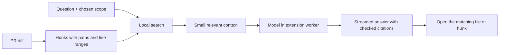

# A local AI assistant for PRs

Investigated 2026-09-15. This is a proposal, not a shipped feature. No model dependency, automatic download, or inference is included in the extension yet.

## Worth doing?

Yes. Start with **Ask about these changes**, backed by local search and a small model. Keep it optional, download once, and keep the code on the device. A good first version should answer “where did session validation change?” and link to the actual hunks. Treat review findings as suggestions to verify.

The hard part is getting the right code into the prompt. The linked langwatch PR already had 454 files and 84,321 changed lines when inspected. A tiny model cannot usefully read that whole PR in one turn. Our current inventory retains counts, not source hunks, so we need a separate, bounded in-memory hunk index.

## Model choices

WebLLM **0.2.85** ships Qwen3.5 model entries, worker support, streaming, and cached weights. I checked the published npm bundle as well as the source registry. Transformers.js **4.2.0** is another option, particularly if we add embeddings. Both versions came from the npm registry during this investigation. [WebLLM model registry](https://github.com/mlc-ai/web-llm/blob/main/src/config.ts), [worker and extension support](https://webllm.mlc.ai/docs/user/advanced_usage.html), [Transformers.js WebGPU](https://huggingface.co/docs/transformers.js/guides/webgpu).

| Candidate                  | Download / memory evidence                                                                         | Role                                                               |
| -------------------------- | -------------------------------------------------------------------------------------------------- | ------------------------------------------------------------------ |
| Qwen3.5 0.8B, WebLLM q4f16 | About 424 MB of weight shards; registry estimates 1,629 MB VRAM with its 4K context configuration  | Small download option; search assistance and brief explanations    |
| Qwen3.5 2B, WebLLM q4f16   | About 1.06 GB of weight shards; registry estimates 2,245 MB VRAM with its 4K context configuration | First candidate to evaluate for cited answers and small reviews    |
| Qwen3.5 4B, WebLLM q4f16   | About 2.37 GB of weight shards; registry estimates 3,868 MB VRAM with its 4K context configuration | Optional larger model, if it earns the extra memory in evaluations |
| Gemma 4 E2B, LiteRT-LM Web | The supported web artifact is about 2.01 GB; actual browser memory still needs measurement         | Compare against Qwen after the basic experience works              |

The download measurements come from repository file metadata, not downloaded weights. They exclude runtime files and, for Qwen, tokenizers/configuration. Registry VRAM figures are estimates, not measurements on Arc. Sources: [Qwen 0.8B files](https://huggingface.co/mlc-ai/Qwen3.5-0.8B-q4f16_1-MLC/tree/main), [2B files](https://huggingface.co/mlc-ai/Qwen3.5-2B-q4f16_1-MLC/tree/main), [4B files](https://huggingface.co/mlc-ai/Qwen3.5-4B-q4f16_1-MLC/tree/main), [Gemma E2B files](https://huggingface.co/litert-community/gemma-4-E2B-it-litert-lm/tree/main).

For reproducibility, the metadata revisions inspected were Qwen 0.8B `0ec138972555613c1d7812a821778ad0398c8790` and Gemma E2B `b3ca0d2f076785a8f4b2219ddbd2bdb99954eae1`. Pin runtime and model revisions together in an implementation; don't fetch mutable `main` assets.

Gemma 4 has an actual browser path: Google's new **LiteRT-LM JavaScript API** explicitly supports the E2B and E4B web artifacts, with streaming and cancellation. It is still an early preview. The older MediaPipe LLM API is in maintenance mode, so don't start there. Gemma 4 wasn't in the published WebLLM bundle I inspected. [LiteRT-LM Web API](https://developers.google.com/edge/litert-lm/js), [MediaPipe migration notice](https://developers.google.com/edge/mediapipe/solutions/genai/llm_inference/web_js).

Google's much smaller mobile/text-only memory figures refer to specific optimized variants. They are not the download size or measured browser footprint of the E2B web artifact. [Gemma memory guide](https://ai.google.dev/gemma/docs/core).

**Recommendation:** prototype with WebLLM + Qwen3.5 2B, offer 0.8B as the small option, and benchmark Gemma E2B separately. This is an implementation judgment; model quality on this repository hasn't been measured.

## What the user gets

- **Find changes:** “Where did we change authorization?” returns ranked files and hunks. Plain text/path search works without loading a model.
- **Ask:** “How does this change session expiry?” answers with clickable file/line references and says when the diff lacks enough context.
- **Explain selection:** choose a file, folder, map cluster, or a few hunks; get a short explanation.
- **Quick review:** inspect the chosen scope for likely bugs and missing cases. Show supporting code for every finding and which files were inspected.
- **Follow up:** retain a short conversation scoped to the current PR revision. Stop, clear, unload the model, and remove its download are visible actions.

Put **Ask AI** on the Changes page. Open a resizable panel outside GitHub's virtualized scroller. Offer “Search changes”, “Explain this folder”, and “Review selected files” before an empty chat box. First use shows the model download size and progress; subsequent use reuses the cached weights. Loading and generation must not block scrolling or category controls.

## How it would fit

1. Parse source hunks alongside inventory counts only when AI is enabled. Keep old/new line numbers, file path, comparison range, and head/base SHA. Bound memory and report omitted files. Clear on navigation or revision change.
2. Start with path/symbol/text ranking. An optional small embedding model can improve meaning-based retrieval later; it adds another download, so measure whether it helps. Exclude generated files by default but let the user include them.
3. Retrieve a few relevant hunks, then build a token-budgeted prompt. Start around 4K context using the actual tokenizer, leaving room for the answer. Fetch additional file context only through explicit, repo-scoped read tools.
4. Run inference in a dedicated worker owned by an extension page. Use a small packaged extension page/window for an Arc prototype; test side-panel availability before depending on it. Keep the GitHub content script as a thin UI/data bridge. A background service worker routes messages, rather than being the sole owner of a model that should survive navigation.
5. Give the model bounded read tools: `search_changes`, `read_hunk`, `list_files`. Check arguments, cap calls and tokens, support cancellation, and validate citations against the indexed hunks. Render model output as text or sanitized Markdown. PR text and comments are source material, never instructions to execute tools or send data elsewhere.
6. Cache weights separately from PR data. Keep source and chat in memory by default, scope every request to its tab/revision, and abort stale work. Nothing posts a GitHub review or edits code automatically.

WebLLM supports workers and extension service workers, but its docs warn that service workers can be killed by the browser. A restart/reload path is necessary even if that architecture is used later. [Worker lifecycle notes](https://webllm.mlc.ai/docs/user/advanced_usage.html).

## Extension constraints

Our current manifest only allows GitHub and its patch host, and its default policy disables WebAssembly. An AI build needs an explicit WASM policy, narrowly scoped optional model-download access, and packaged JavaScript/WASM assets. Download model weights as data; don't copy a demo that loads executable runtime code from a CDN. [Chrome extension CSP](https://developer.chrome.com/docs/extensions/reference/manifest/content-security-policy), [remote hosted code rules](https://developer.chrome.com/docs/extensions/develop/migrate/remote-hosted-code).

Check `navigator.gpu`, adapter availability, limits, and required features at runtime. Handle insufficient storage, interrupted downloads, lost GPU devices, and multiple PR tabs. The installed Arc version here is 1.164.0; that alone doesn't prove its GPU/runtime compatibility. Firefox and Safari need their own verification. Basic search should remain available when inference can't run.

## What to measure before shipping

No tokens/second, latency, review accuracy, or real Arc inference results were measured in this investigation. Don't turn model-card benchmarks into product claims.

- **Real models, opt-in test:** cold download, warm load, first token, answer speed, peak memory, cache reuse, cancellation, GPU loss, and tab navigation on Arc/Chrome and at least one constrained laptop.
- **Useful answers:** a fixed set of questions and seeded bugs across TS, React, Go, tests, and config. Track retrieval success, valid citations, supported claims, missed bugs, and false findings. Compare 0.8B, 2B, and Gemma on the same prompts.
- **Large PRs:** the linked langwatch PR, generated-heavy changes, renamed files, missing context, unavailable diffs, and commit-range views. Show exactly what was searched or reviewed.
- **Normal CI:** deterministic fake worker for download/progress/cancel/error states, stale response rejection, safe rendering, and citation navigation. Add screenshots for compact/expanded chat in both themes. Keep GPU downloads out of ordinary pull-request tests.
- **Packaging check:** assert runtime assets are bundled and model downloads are opt-in. Verify the normal extension still starts with no AI network requests.

Ship search and cited Q&A first. Add review once the evaluation shows it finds useful problems without drowning the user in guesses.
